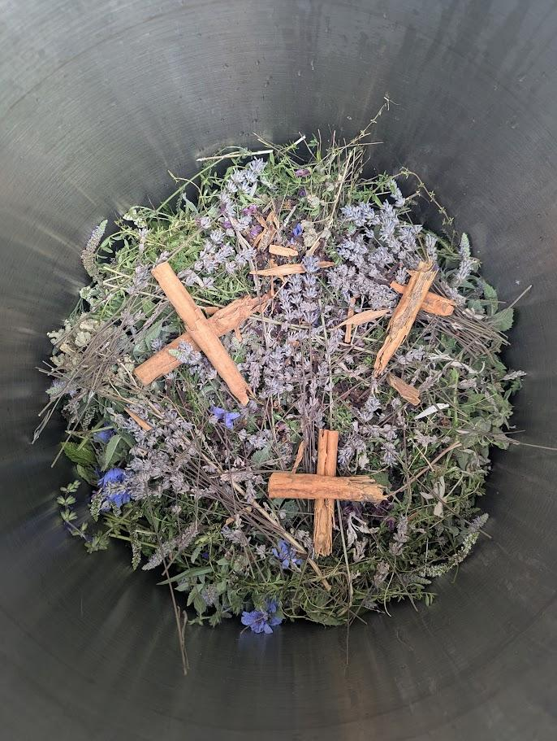
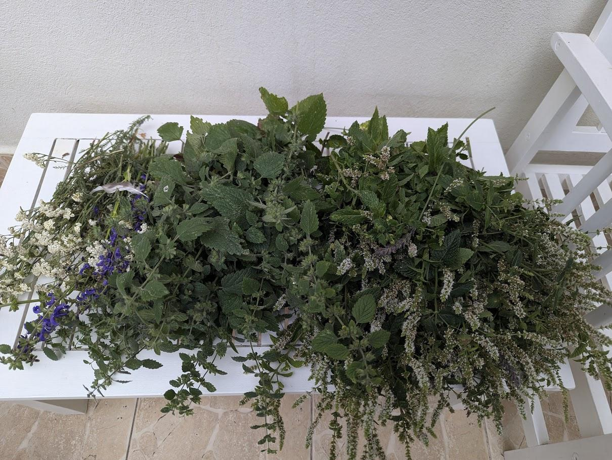
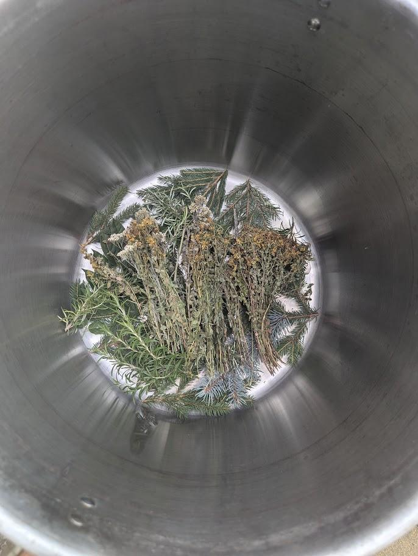
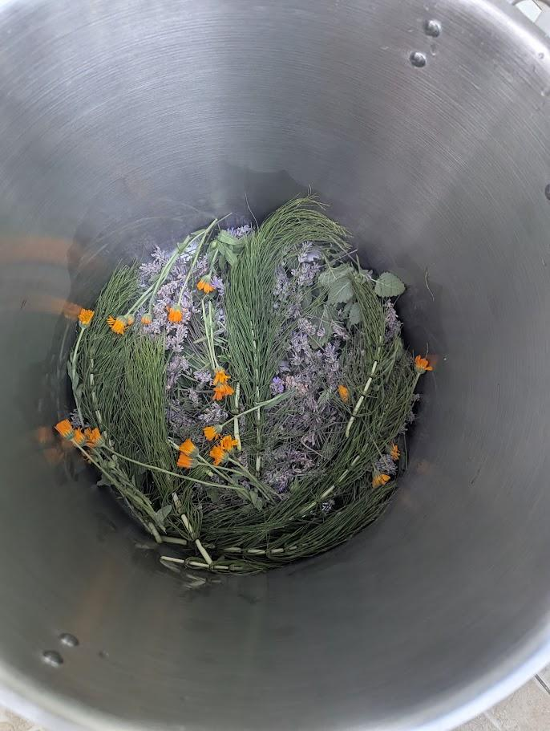
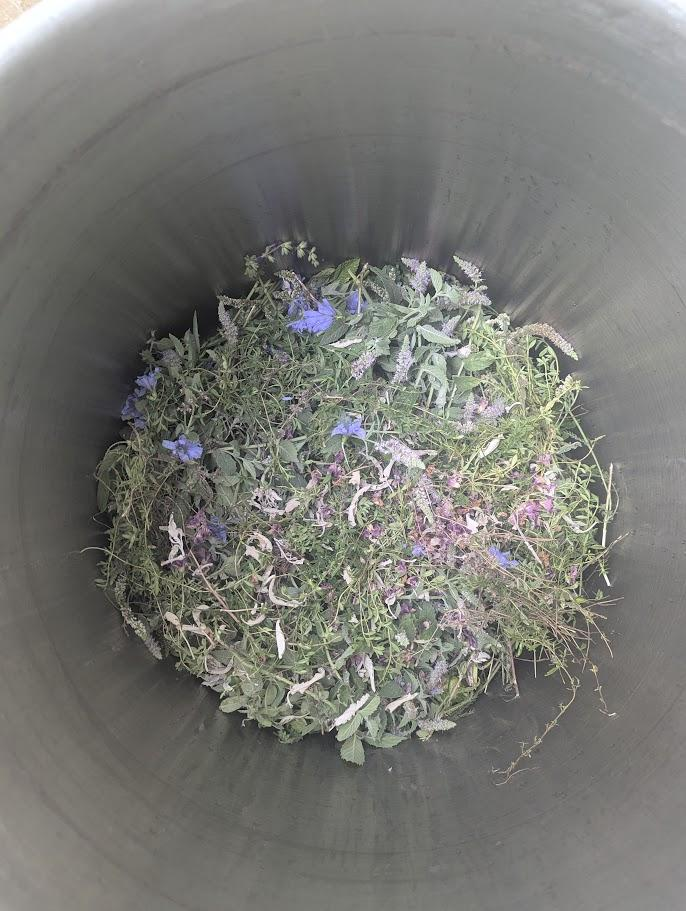
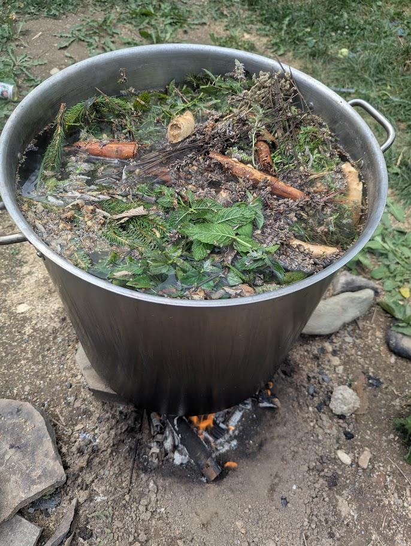
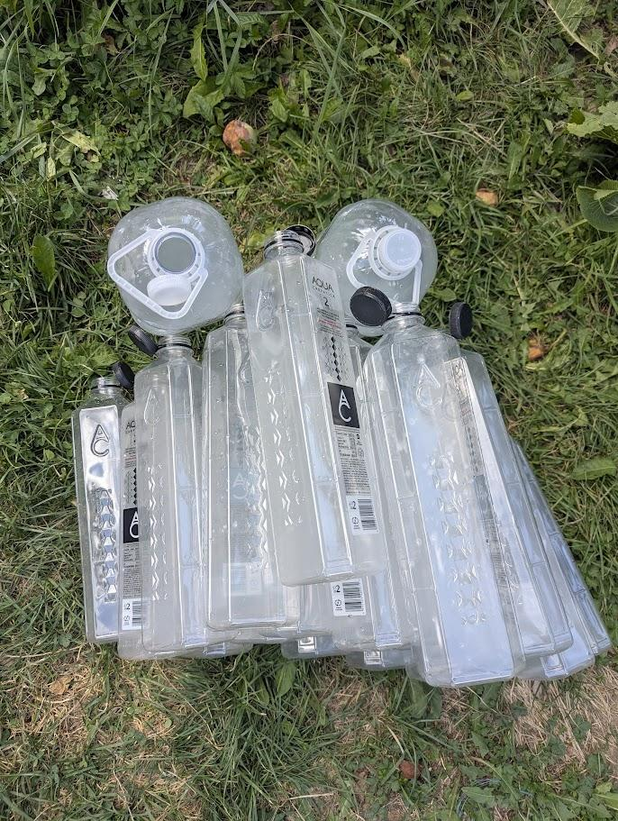
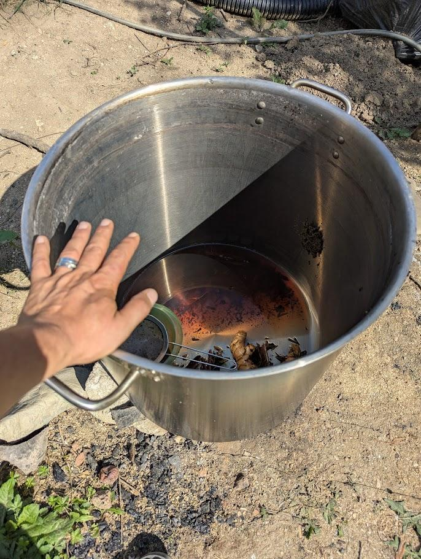
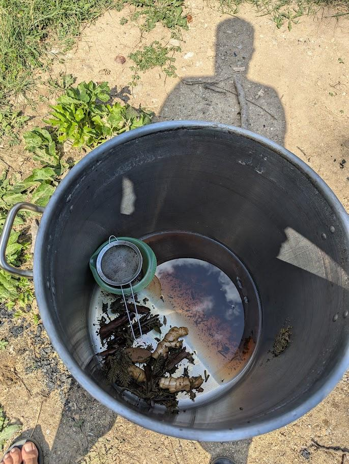
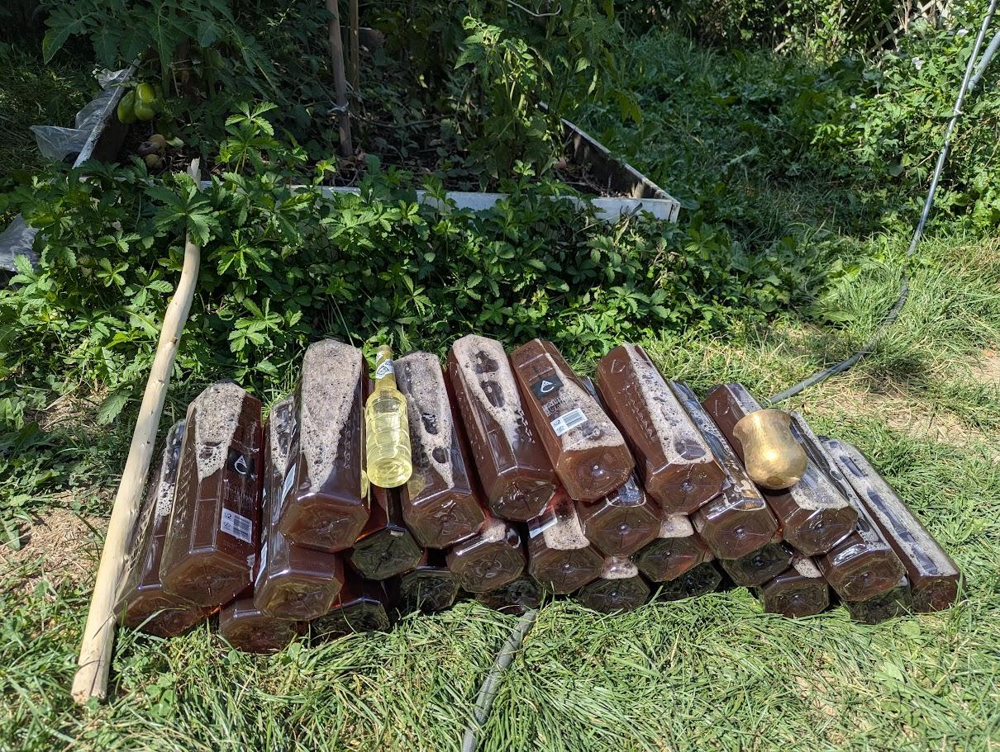

# Verdes Medicinas Recipe

Created: August 21, 2025 12:16 AM

# Recipe Information

**Type:** [Tea]

**Difficulty Level:** [Intermediate]

**Prep Time:** 7-10 hours of preparation

**Cook Time:** [3-5 hours of cooking]

**Total Time:** [10-15 hours]

**Servings:** [70 liters]

---

# Medicinas Verdes

---

# Ingredients

### Main Ingredients

- [ ]  Fresh Mint - 200-300 grams
- [ ]  Fresh Lavender - 150 -200 grams
- [ ]  Fresh Melissa

### Seasonal Herbs

- [ ]  John’s Worth
- [ ]  Coada Soricelului
- [ ]  White Sage

### Spices

- [ ]  Cinnamon rolls - 1 big roll (40 cm)
- [ ]  Clove - 75-100 grams
- [ ]  Anis - 50-75 grams

---

# Equipment Needed

- Big Pot
- Sieve
- Jug

---

# Step-by-Step Instructions

## Step 1: Preparation

**Description:** [Assemble the herbs in the pot]

**Instructions:**

1. Put layers of herbs starting with the Mint, Lavender, Melissa
2. Blow mapacho smoke on them
3. Put layers of optional herbs on top
4. Blow mapacho smoke on them
5. Put spices in and arrange them 
6. Blow mapacho smoke on them
7. Sing the Verdes Medicina Icaro 

[https://media.zgondea.com/3.VerdeVerdeMedicina.mp3](https://media.zgondea.com/3.VerdeVerdeMedicina.mp3)

## Step 2: Cooking Process

**Description:** [The cooking takes around 3-4 hours and the medicine should be attended at all times]

**Instructions:**

1. After mounting the pot over the fireplace in a steady position fill it with water up to 2-3 cm from the top 
2. Start the fire and keep the lid on
3. Pour all the love, blessings, prayers into the pot with medicine and sing the Verdes Medicinas icaro as well 
4. Wait for the medicina to start boiling, usually it spills a little bit. 
5. At that point you can stop adding wood to the fire and take the lid off 
6. Wait 10 minutes to 2 hours before removing the plants from the tea depending on how strong and concentrated you want the medicine to be
7. Wait for the tea to cool down before proceding to the next step

## Step 3: Final Assembly

**Description:** [Brief description]

**Instructions:**

1. Once the Tea is cooled down you can start blowing mapacho smoke on the tea and on the bottles you want to load up with tea
2. After the bottles have been blessed use a jug and a sieve to pour the content into the bottles
3. You can bless each bottle individually if it’s for a specific person or ailment. 

---

# Recipe Media & Inspiration

## Icaro 🎵

> Icaro for the Verdes Medecinas
> 

[https://media.zgondea.com/3.VerdeVerdeMedicina.mp3](https://media.zgondea.com/3.VerdeVerdeMedicina.mp3)

[Add your cooking playlist or background music here](https://www.notion.so)

---

# Chef's Notes & Tips

<aside>
👨‍🍳

**Pro Tips from the Chef:**

- Important tip #1
- Cooking technique tip #2
- Ingredient substitution tip #3
</aside>

### Recipe Variations

- **Variation 1:** [Description of how to modify]
- **Variation 2:** [Another way to customize]
- **Dietary Modifications:** [Vegan, gluten-free, etc. options]

### Storage Instructions

- **Refrigerator:** [How long and how to store]
- **Freezer:** [Freezing instructions if applicable]
- **Reheating:** [Best methods to reheat]

---

# Recipe Reviews & Ratings

## My Rating: ⭐⭐⭐⭐⭐

### What Worked Well:

- Point 1
- Point 2
- Point 3

### Next Time I'll Try:

- Improvement idea 1
- Modification idea 2

### Family/Friends Feedback:

> *"Add quotes from people who tried your recipe"*
> 

---

# Recipe Source & Credits

**Original Recipe:** [Verdes Medicinas - Jungle of Peru]

**Inspiration:** [Gumercindo Galindo]

**Date Created:** August 20, 2025

**Created By:** @Paul Zgondea

---

# Quick Reference Card

| **Aspect** | **Details** |
| --- | --- |
| Total Time | [Time] |
| Difficulty | [Level] |
| Servings | [Number] |
| Main Ingredients | [Key ingredients] |